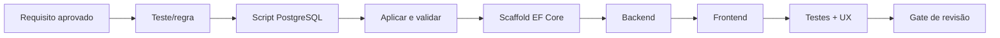

# Roadmap de implementação do MVP

> Este arquivo substitui o antigo `PLANO_DESENVOLVIMENTO_MVP.md` da raiz. Ele organiza dependências e gates; planos detalhados são criados e aprovados uma fatia por vez.

## Objetivo

Entregar o ciclo completo do VetCommission em incrementos pequenos, testáveis e utilizáveis:

```text
Cadastrar → Configurar → Registrar → Calcular → Conferir
→ Contestar → Resolver → Fechar → Consultar
```

## Fontes de verdade e precedência

1. Regras explícitas de [`01_REQUISITOS_NEGOCIO_MVP.md`](../../../Requisitos/VETCOM_MVP_UI_UX_V1/01_REQUISITOS_NEGOCIO_MVP.md).
2. Contrato global [`ARQUITETURA.MD`](../../../ARQUITETURA.MD).
3. Perfil ativo [`ARQUITETURA_POSTGRES_DB.MD`](../../../ARQUITETURA_POSTGRES_DB.MD).
4. Documento especializado de UI/UX e acessibilidade.
5. Plano detalhado aprovado da fatia.

Em caso de divergência, a implementação para até a documentação ser corrigida. Scripts já aplicados nunca são alterados.

## Arquitetura-alvo

```text
src/
  VetCommission.Domain/
  VetCommission.Application/
  VetCommission.Infrastructure/
  VetCommission.WebApi/
  VetCommission.Worker/
frontend/
tests/
  VetCommission.UnitTests/
  VetCommission.IntegrationTests/
database/scripts/
scriptsPS/
```

```text
WebApi -> Application -> Domain
WebApi -> Infrastructure -> Domain
Worker -> Application -> Domain
Worker -> Infrastructure -> Domain
Frontend -> WebApi por HTTP
```

O MVP usa monólito modular, um frontend Next.js e um Worker separado da WebApi. Módulos são organizados por feature/caso de uso, não como microserviços.

## Regras transversais desde a primeira fatia

- Multi-tenant obrigatório com `X-Tenant-Id`, validação de vínculo e defesa em profundidade.
- Database First com PostgreSQL real e Testcontainers.
- MediatR, FluentValidation, `NotificationResult`, repositórios e `IUnitOfWork`.
- JWT e policies por recursos sincronizados com o frontend.
- React Query para estado remoto; React Hook Form + Zod para formulários.
- Snapshot de regras e valores financeiros; auditoria criada junto à operação relevante.
- UX, acessibilidade e responsividade verificadas em cada fatia.
- Cálculo definitivo somente no backend; o frontend exibe a prévia devolvida pela API.

## Fluxo de uma fatia persistente



## Sequência das entregas

| ID | Fatia | Entrega utilizável | Dependência | Plano detalhado |
|---|---|---|---|---|
| 00 | Decisões arquiteturais | Contratos centrais sem ambiguidade | — | [Abrir](00-decisoes-arquiteturais.md) |
| 01 | Fundação da solução | Solução e frontend compilando, testes-base e infraestrutura comum | 00 | [Abrir](01-fundacao-da-solucao.md) |
| 02 | Identidade, tenant e acesso | Login e isolamento por tenant/perfil | 01 | [Abrir](02-identidade-tenant-acesso.md) |
| 03 | Profissionais | Cadastro e inativação ponta a ponta | 02 | [Abrir](03-profissionais.md) |
| 04 | Categorias e procedimentos | Catálogo utilizável na produção | 03 | [Abrir](04-categorias-procedimentos.md) |
| 05 | Competências e regras | Período aberto e regra vigente determinável | 04 | [Abrir](05-competencias-regras-comissao.md) |
| 06 | Produção e cálculo | Produção gera comissão e snapshot atomicamente | 05 | [Abrir](06-producao-calculo.md) |
| 07 | Conferência administrativa | Consulta, detalhe e correção auditada | 06 | [Abrir](07-conferencia-administrativa.md) |
| 08 | Portal profissional | Profissional consulta somente seus dados | 06 | [Abrir](08-portal-profissional.md) |
| 09 | Contestações | Divergência resolvida com decisão e recálculo | 07 e 08 | [Abrir](09-contestacoes.md) |
| 10 | Fechamento | Competência validada, fechada e somente leitura | 09 | [Abrir](10-fechamento.md) |
| 11 | Dashboard e relatórios | Operação consultável sem planilha paralela | 10 | [Abrir](11-dashboard-relatorios.md) |
| 12 | Consolidação do piloto | Jornadas A–H, segurança e UX final validadas | 11 | [Abrir](12-consolidacao-piloto.md) |

Os planos 02–12 são briefs de execução e devem ser refinados com arquivos e interfaces exatos quando a etapa anterior estabilizar seus contratos. Isso evita congelar antecipadamente nomes gerados pelo scaffold ou contratos ainda não aprovados.

## Escopo de cada fatia futura

### 02 — Identidade, tenant e acesso

Schemas `core`, usuário, vínculo, grupos/recursos, login/me, JWT, tenant ativo, guards, menus, primeiro acesso aprovado e testes de vazamento.

### 03 — Profissionais

Lista, criação, edição, detalhe, ativação/inativação, permissões, estados visuais e preservação histórica.

### 04 — Categorias e procedimentos

Catálogo, valor padrão, filtros e inativação sem alterar produções históricas.

### 05 — Competências e regras

Período em aberto, timezone aprovado, percentual/fixo, regra geral/específica, vigência, prevenção de sobreposição e prévia.

### 06 — Produção e cálculo

Prévia, gravação transacional de produção + comissão + snapshot + auditoria, arredondamento aprovado, lista e detalhe.

### 07 — Conferência administrativa

Filtros, correção permitida, recálculo, antes/depois e bloqueio por competência.

### 08 — Portal profissional

Dashboard, procedimentos, memória de cálculo, comissões e extrato mobile-first. Nenhum endpoint aceita profissional arbitrário para dados pessoais; o escopo deriva da identidade.

### 09 — Contestações

Abertura vinculada ao lançamento, acompanhamento, comparativo, decisão justificada e recálculo atômico quando aprovado.

### 10 — Fechamento

Diagnóstico, pendências, confirmação, concorrência, idempotência, bloqueio e consulta histórica administrativa/profissional.

### 11 — Dashboard e relatórios

KPIs e relatórios consultivos mínimos definidos nos requisitos. Exportação fica para evolução futura.

### 12 — Consolidação do piloto

Jornadas A–H, acessibilidade, responsividade, referências visuais, segurança, desempenho básico e documentação operacional.

## Itens adiados até decisão explícita

- Landing page comercial completa.
- Pagamento/comprovante.
- Anexos de arquivos em contestações.
- Exportações avançadas.
- Notificações externas e Slack.
- Recuperação automatizada de senha.

## Gate de avanço

Uma fatia avança somente quando:

- plano detalhado foi aprovado;
- critérios funcionais e de UX estão atendidos;
- verificações previstas têm evidência recente;
- isolamento por tenant/profissional foi testado;
- scripts e scaffold foram revisados quando aplicáveis;
- não existe pendência que invalide o contrato da fatia seguinte;
- resultado e pendências foram registrados na issue.

## Definition of Done

Aplicar o [padrão de plano](../PADRAO_PLANO_IMPLEMENTACAO.md). A revisão final não substitui qualidade incremental.
